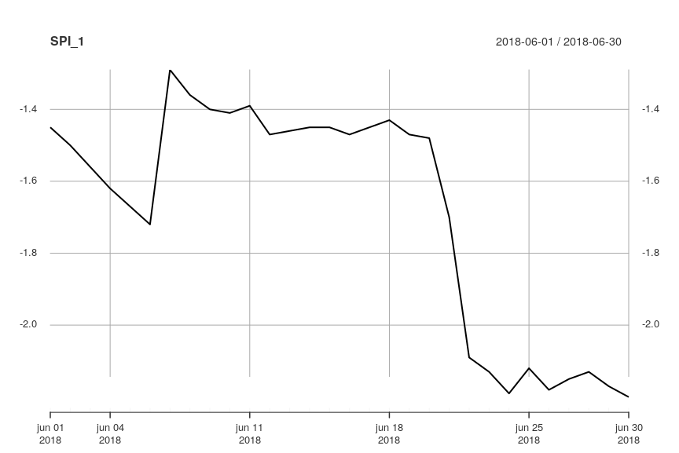
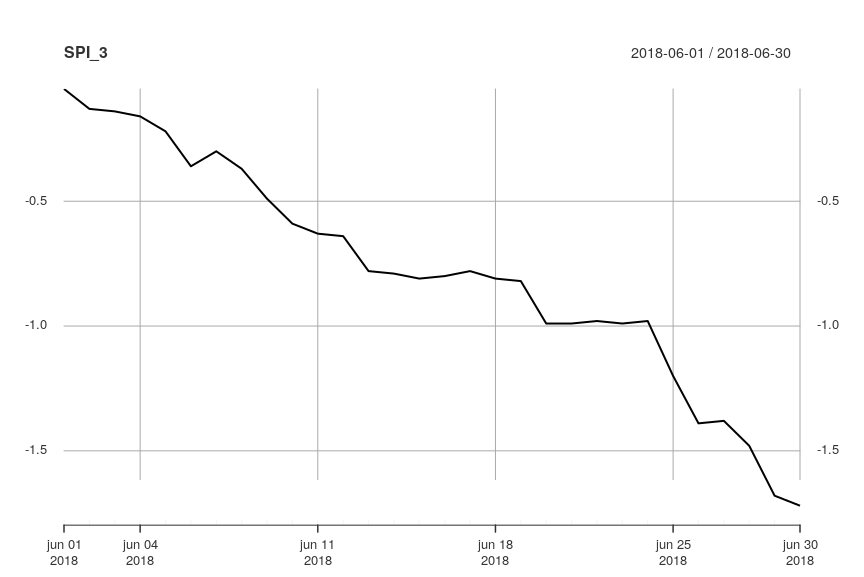

# standaRdized

standaRdized is an R package for the calculation of Standardized Index values (SPI, SPEI, SSI,...) on a daily basis. The Standardized Precipitation Index (SPI) was developed by [McKee et al (1993)](https://climate.colostate.edu/pdfs/relationshipofdroughtfrequency.pdf) \[1] as a monthly indicator for meteorological drought, and has since become one of the most widely used drought indicators. The standardized index procedure has also been applied to time series of the precipitation-evaporation balance (Standardized Precipitation Evapotranspiration Index, SPEI), and streamflow (Standardized Streamflow Index, SSI).

This package provides functions to calculate Standardized Index values on a daily basis in a generalized way: it allows the use of several distributions, aggregation periods, reference periods, and aggregation functions. This allows the calculation of Standardized Index values for a wide range of environmental data (e.g. groundwater levels, temperature,…).

Further details:
* [Standardized Index calculation](docs/calculation/calculation.md)
* [function help](docs/standaRdized.pdf)
<!---* applications--->

## Installation

standaRdized can be installed from [GitHub](https://github.com/WillemMaetens/standaRdized) with:

```r
# install.packages("devtools")
devtools::install_github("WillemMaetens/standaRdized")
```

## Getting started

standaRdized uses [xts (eXtensible Time Series)](https://cran.r-project.org/web/packages/xts/index.html) as input and output objects. Some tutorials for constructing xts objects, data input, or working with the Standardized Index output can be found [here](https://www.datacamp.com/community/blog/r-xts-cheat-sheet?utm_source=adwords_ppc&utm_campaignid=898687156&utm_adgroupid=48947256715&utm_device=c&utm_keyword=&utm_matchtype=b&utm_network=g&utm_adpostion=1t1&utm_creative=332602034349&utm_targetid=dsa-473406570475&utm_loc_interest_ms=&utm_loc_physical_ms=9040077&gclid=EAIaIQobChMI29a18uCz4QIV2OFRCh1ZxwefEAAYASAAEgLsgfD_BwE) or [here](http://rstudio-pubs-static.s3.amazonaws.com/288218_117e183e74964557a5da4fc5902fc671.html).

Load the package with:

```r
library(standaRdized)
```

The package includes example daily rainfall data for the Ukkel station in Belgium (source: [ECA&D](https://www.ecad.eu/)). This data can be loaded with:

```r
data("Ukkel_RR")
```

The function `fprint()` can be used to print xts objects or lists of xts objects in a formatted manner. It prints the `xtsAttributes` where the metadata for time series are stored, and the `head` and `tail` of xts time series.

```r
fprint(Ukkel_RR)
#> Attributes:                            
#> name      :  Ukkel          
#> country   :  Belgium        
#> element   :  RR             
#> unit      :  mm             
#> longitude :  4.36638889     
#> latitude  :  50.8           
#> elevation :  100            
#> source    :  ECA&D (ecad.eu)
#> 
#> Data:
#>            value
#> 1880-01-01    NA
#> 1880-01-02   0.4
#> 1880-01-03   0.0
#> 1880-01-04   0.0
#> 1880-01-05   0.0
#> ...                
#> 2019-02-24     0
#> 2019-02-25     0
#> 2019-02-26     0
#> 2019-02-27     0
#> 2019-02-28    11
```

Calculating Standardized Indexes on a daily basis requires that monthly total precipiation as the basis for SPI calculation as in the original definition is replaced by the total rainfall over a specific number of days (the aggregation period). Although it is possible to do this for any number of days, the traditional definition of SPI-1 (based on total precipitation for 1 month) and SPI-3 (based on total precipitation for 3 months) is approximated by using a fixed period of 30 days for a month. Hence, SPI-1 represents total precipitation over 30 days, SPI-3 total precipitation over 90 days, etc.

Standardized Index values are calculated by the function `standardized.index()`. Minimum required arguments for this function are `data`: an `xts` object with the input time series (e.g. `Ukkel_RR`), `agg.length`: the length of the aggregation period in days and `index.out`: the output dates for which to calculate the SPI:

```r
dates <- seq(from=as.Date('2018-06-01'),to=as.Date('2018-06-30'),by=1)
```
By default, `standardized.index` uses the `gamma` distribution and aggregates data using the `sum` function as these are traditional for the SPI. Hence, the SPI-1 (which has an `agg.length` of `30` days) for June 2018 is calculated as follows:

```r
SPI_1 <- standardized.index(data=Ukkel_RR,agg.length=30,index.out=dates)
fprint(SPI_1)
#> Attributes:                          
#> agg.length        :  30   
#> agg.fun           :  sum  
#> distr             :  gamma
#> method            :  mle  
#> ref.length        :  30   
#> ref.na.thres      :  10   
#> agg.na.thres      :  10   
#> agg.interpolation :  none 
#> 
#> Data:
#>            value
#> 2018-06-01 -1.45
#> 2018-06-02 -1.50
#> 2018-06-03 -1.56
#> 2018-06-04 -1.62
#> 2018-06-05 -1.67
#> ...                
#> 2018-06-26 -2.18
#> 2018-06-27 -2.15
#> 2018-06-28 -2.13
#> 2018-06-29 -2.17
#> 2018-06-30 -2.20
plot(SPI_1)
```



To calculate the SPI-3 (which has an `agg.length` of `90` days), just modify the `agg.length` argument:

```r
SPI_3 <- standardized.index(data=Ukkel_RR,agg.length=90,index.out=dates)
fprint(SPI_3)
#> Attributes:                          
#> agg.length        :  90   
#> agg.fun           :  sum  
#> distr             :  gamma
#> method            :  mle  
#> ref.length        :  30   
#> ref.na.thres      :  10   
#> agg.na.thres      :  10   
#> agg.interpolation :  none 
#> 
#> Data:
#>            value
#> 2018-06-01 -0.05
#> 2018-06-02 -0.13
#> 2018-06-03 -0.14
#> 2018-06-04 -0.16
#> 2018-06-05 -0.22
#> ...                
#> 2018-06-26 -1.39
#> 2018-06-27 -1.38
#> 2018-06-28 -1.48
#> 2018-06-29 -1.68
#> 2018-06-30 -1.72
plot(SPI_3)
```



By default, `standardized.index` uses the entire `data` object as reference data to determine the reference data on which a distribution is fitted. However, it is possible to provide a seperate `ref.data` xts that will be used to determine the reference data. This allows the calculation of Standardized Index values for time series of limited length by using another, longer, time series from a nearby station as reference data. This is how the SPI values published by the [Flanders Evironment Agency](https://en.vmm.be/) at [waterinfo.be](https://www.waterinfo.be/default.aspx?path=NL/Thema/Droogte_Actueel&KL=en) are calculated: the SPI-1 and SPI-3 for 43 raingauges with data from 2004 onwards are calculated by using the long term daily rainfall record at [RMI](https://www.meteo.be/en)'s Ukkel station as reference data.

Furthermore, the `ref.years` and `ref.length` arguments allow to set which period of data to use as reference period. By default (`ref.years = NULL`), the full dataset length of `ref.data` is used, but you can provide specific years to be used as reference period. For instance, the [European Drought Observatory](http://edo.jrc.ec.europa.eu) uses the years [1981-2010 as reference period](http://edo.jrc.ec.europa.eu/documents/factsheets/factsheet_spi_ado.pdf):

```r
SPI_1 <- standardized.index(data=Ukkel_RR,agg.length=30,index.out=dates,ref.years=seq(1981,2010))
fprint(SPI_1)
#> Attributes:                                                                                   
#> agg.length        :  30                                                            
#> agg.fun           :  sum                                                           
#> distr             :  gamma                                                         
#> method            :  mle                                                           
#> ref.years         :  1981, 1982, 1983, 1984, 1985, 1986, 1987, 1988,... [truncated]
#> ref.length        :  30                                                            
#> ref.na.thres      :  10                                                            
#> agg.na.thres      :  10                                                            
#> agg.interpolation :  none                                                          
#> 
#> Data:
#>            value
#> 2018-06-01 -2.10
#> 2018-06-02 -2.15
#> 2018-06-03 -2.45
#> 2018-06-04 -2.58
#> 2018-06-05 -2.53
#> ...                
#> 2018-06-26 -2.22
#> 2018-06-27 -2.15
#> 2018-06-28 -2.11
#> 2018-06-29 -2.16
#> 2018-06-30 -2.20
```

Alternatively, instead of a set reference period, a set number of years preceding the date for which the Standardized Index is calculated can be used by setting `ref.years = NA` and specifying `ref.length` as a set number of years (by default, this is `30`). This is the setting used by VMM to calculate the SPI values shown on [waterinfo.be](https://www.waterinfo.be/default.aspx?path=NL/Thema/Droogte_Actueel&KL=en).

```r
SPI_1 <- standardized.index(data=Ukkel_RR,agg.length=30,index.out=dates,ref.years=NA,ref.length=30)
fprint(SPI_1)
#> Attributes:                          
#> agg.length        :  30   
#> agg.fun           :  sum  
#> distr             :  gamma
#> method            :  mle  
#> ref.years         :  NA   
#> ref.length        :  30   
#> ref.na.thres      :  10   
#> agg.na.thres      :  10   
#> agg.interpolation :  none 
#> 
#> Data:
#>            value
#> 2018-06-01 -1.89
#> 2018-06-02 -1.84
#> 2018-06-03 -2.06
#> 2018-06-04 -2.16
#> 2018-06-05 -2.21
#> ...                
#> 2018-06-26    NA
#> 2018-06-27    NA
#> 2018-06-28    NA
#> 2018-06-29    NA
#> 2018-06-30    NA
```

Note how this introduces NA values in the output as the data for more recent years in the Ukkel_RR series has not yet been consolidated and the function's default tolerance for 10% missing data in the aggregation period or reference period is exceeded.  

For more information on the calculation procedure for Standardized Index values, see: [Standardized Index calculation](docs/calculation/calculation.md).

For more information on the package's functions, see: [function help](docs/standaRdized.pdf).

<!---For more use cases for working with other types of data such as the precipitation-evaporation balance (SPEI) or streamflow (SSI), handling NA values, different distributions and fitting methods, forecasting and optimizing calculation, see: Applications.--->

## References

\[1] McKee, T.B., Doesken, N.J. and Kleist, J., 1993. The relationship of drought frequency and duration to time scales. In Proceedings of the 8th Conference on Applied Climatology, American Meteorological Society. Vol. 17, No. 22, pp. 179-183.
